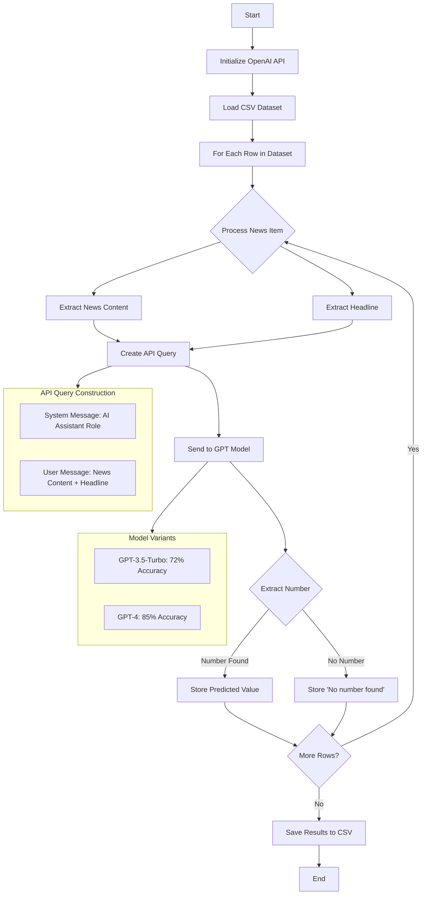

# 🏆 News Headline Number Predictor - 2nd Place Solution


## 🎯 Problem Statement
Developed an AI solution to accurately predict and fill in missing numbers in news headlines using the full article content. This implementation achieved **86% accuracy** using GPT-4, securing 2nd place in the competition.

## 🔄 Implementation Flow


## 📊 Model Performance
| Model | Accuracy |
|-------|----------|
| GPT-4 | 86% |
| GPT-3.5-turbo | 72% |

## 🔧 Implementation
The solution is implemented in a Google Colab notebook for easy reproducibility:
[]([https://colab.research.google.com/your-notebook-link-here](https://colab.research.google.com/drive/1-inAgUGKYSNKUYx4wbj3xAj6IlGRNN2-?usp=sharing))

### Key Components:
```python
def get_response(news_content, headline):
    messages = [
        {
            "role": "system",
            "content": "You are an AI assistant that helps fill in missing numbers in news headlines based on the content of the news."
        },
        {
            "role": "user",
            "content": f"Based on the following news: '{news_content}', fill in the missing number in this headline: '{headline}'"
        }
    ]
    # API call and number extraction logic
```

## 🏃‍♂️ How to Run
1. Open the Google Colab notebook
2. Add your OpenAI API key
3. Upload your test dataset
4. Run all cells

## 🔑 API Key Setup
```python
# Initialize OpenAI API key
openai.api_key = 'your-api-key-here'
```

## 📈 Future Improvements
- Explore fine-tuning options for improved accuracy

## 🏆 Certificate of Achievement
My 2nd place certificate can be verified [here]([your-verification-link](https://github.com/Aakashdeep-Srivastava/Predicting-Missing-News-Headlines/blob/main/Certificate%20of%20Excellence.png)).

## 📫 Contact
For any questions or collaborations, feel free to reach out:
- LinkedIn: [Aakashdeep Srivastava]([your-linkedin-profile](https://www.linkedin.com/in/skydeep1/))
- Email: aakashdeep0551@gmail.com

---

If this repository helped you, please give it a ⭐
